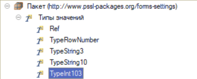
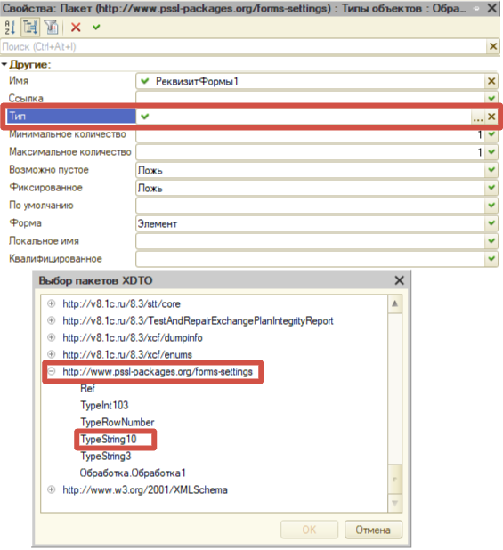
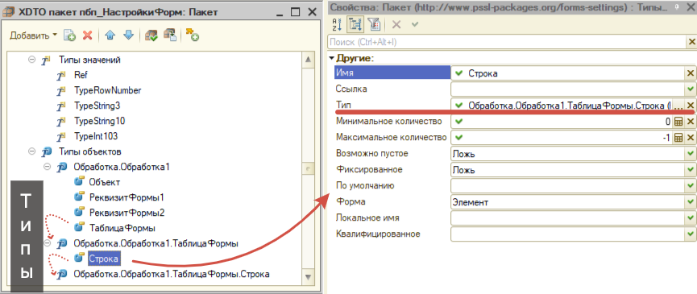
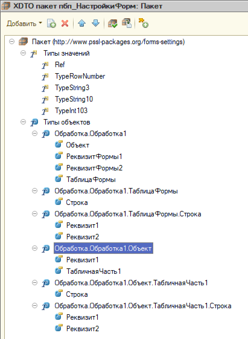
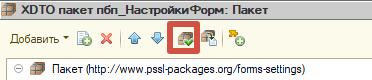
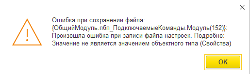
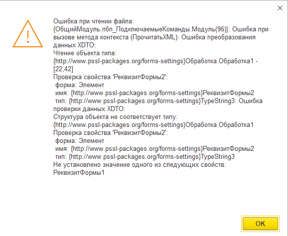

# Заполнение XDTO-пакета настроек формы

Структура типа пакета XDTO обязана повторять структуры формы, а именно: соответствия реквизитов формы, объекта, табличных частей и имен свойств типа XDTO с именами реквизитов.

> [!NOTE]
> В пакете могут отсутствовать реквизиты, которые есть на форме - тогда выгрузка и загрузка значений этих реквизитов выполнена не будет. Таким образом можно регулировать состав выгрузки.

Начать "отрисовку" пакета нужно с создания корневого типа, который будет, фактически, соответствовать форме. Для примера возьмем форму абстрактной обработки, которая выглядит следующим образом:


Зададим требования к составу полей: из всех реквизитов формы нам необходимо сохранять значения Реквизит1 Объекта, ТабличнаяЧасть1 Объекта, РеквизитФормы1, РеквизитФормы2, ТаблицаФормы.

Создадим корневой тип в пакете:


Как видно из скриншота, в корневом типе указаны только реквизиты верхней иерархии на форме. Для начала рассмотрим подробно свойства полей и фасеты типов значений.

### Описание свойств типа пакета XDTO
<details>
<summary>Нажать, чтобы развернуть</summary>


1. **Имя** - имя атрибута. ***Оно должно соответствовать имени реквизита объекта***;
2. **Ссылка** - <u>Не используется в контексте этой подсистемы</u>;
3. **Тип** - тип поля. В этот тип будет конвертироваться (сериализоваться) значение реквизита формы. Поддерживает указание базовых типов из пространства http://www.w3.org/2001/XMLSchema и выбор своих типов значений, объявленных в пространствах имен конфигурации, в том числе локального пакета (подробно см. [в создание типов пакета XDTO](#создание-типов-значений-пакета-xdto));
4. **Минимальное количество** - название говорит само за себя, но также с помощью этого свойства можно устанавливать обязательность поля: если указан 0, то поле необязано находиться в файле (работает как "*nullable=true*"); в противном случае поле должно быть всегда;
5. **Максимальное количество** - максимальное количество элементов. Для коллекций элементов (по типу табличной части) устанавливается -1, что означет неограниченное количество;
> [!TIP]
> Проще говоря, если поле является обязательным и не является коллекцией, то для него должно быть установлены значения 1:1 (мин:макс количество). Для необязательных полей - 0:1. Для строки коллекции - 0:-1, если она необязательна; 1:-1 - если обязательна.
6. **Возможно пустое** - если Истина, то поле может быть не заполнено;
7. **Фиксированное** - если Истина - объект, должен содержать в данном свойстве указанное значение по умолчанию;
8. **По умолчанию** - фиксированное значение;
9. **Форма** - вид вывода значения поля в файле:
    - *Атрибут* - выводится как тэг в строке объявления типа;
    - *Элемент* - выводится отдельным атрибутом внутри типа;
    - *Текст* - представление свойства в виде содержания элемента XML. <u>Не используется в контексте этой подсистемы</u>;
```xml
// Вид формы "Атрибут" поля "BeginningNumber"
<DataProcessor.UniversalFileDownloadFromTableFile xmlns="http://www.pssl-packages.org/forms-settings" xmlns:xs="http://www.w3.org/2001/XMLSchema" xmlns:xsi="http://www.w3.org/2001/XMLSchema-instance" BeginningNumber="2">
```
```xml
// Вид формы "Элемент" поля "BeginningNumber"
<DataProcessor.UniversalFileDownloadFromTableFile xmlns="http://www.pssl-packages.org/forms-settings" xmlns:xs="http://www.w3.org/2001/XMLSchema" xmlns:xsi="http://www.w3.org/2001/XMLSchema-instance">
    <BeginningNumber>2</BeginningNumber>
</DataProcessor.UniversalFileDownloadFromTableFile>
```
10.  **Локальное имя** - если заполнено это поле, то в файл попадает значение из этого поля. Если не заполнено, то выгружается значение из свойства "Имя";
11.  **Квалифицированное** - определяет необходимость квалификации свойства при сериализации в XML. <u>Не используется в контексте этой подсистемы</u>;
</details>

### Создание типов значений пакета XDTO
<details>
<summary>Нажать, чтобы развернуть</summary>
Типы значений необходимы для установки квалификаторов типа: установка минимальной/максимальной длины строки, количество знаков после запятой у числа и т.д. После создания типа значения, ссылку на него можно указывать как "Тип" свойства поля.

> [!NOTE]
> Создание типов значений не является обязательным, но рекомендуемым. Таким образом можно обеспечить защиту от инъекций файла XML: когда файл был изменен напрямую и заполнен неправильным значением. В этом случае, при сериализации мы получим читаемую ошибку о несоответствии типа значения поля файла XSD-схеме. 


Для начала нужно понять, за что отвечает каждое свойство:


1. **Имя** - название типа в пространстве имен;
2. **Базовый тип** - ссылка на тип, на который мы накладываем квалификаторы. Рекомендуется использовать типы пространства http://www.w3.org/2001/XMLSchema, так как пространство является глобальным: универсальными для всех платформ;
3. **Вариант** - вариант содержания типа значения:
    - *Атомарный* - атомарный вариант содержания типа значения. Например, такой вариант имеют строки формата UUID;
    - *Список* - тип значения является списком (других типов). <u>Не используется в контексте этой подсистемы</u>;
    - *Объединение* - тип значения является объединением (других типов). <u>Не используется в контексте этой подсистемы</u>;
4. **Тип элемента** - тип элемента списка, если выбран вариант "Список";
5. **Типы объединения** - типы значений объединения, если выбран вариант "Объединение";
6. **Длина** - квалификатор строки - длина фиксированной строки;
7. **Минимальная длина** - квалификатор строки - минимальная длина строки;
8. **Максимальная длина** - квалификатор строки - максимальная длина строки;
9.  **Пробельные символы** - фасет пробельных символов. <u>Не используется в контексте этой подсистемы</u>;
10. **Минимум, включающий границу** - Фасет минимального включающего значения. <u>Не используется в контексте этой подсистемы</u>;
11. **Минимум, не включающий границу** - Фасет минимального исключающего значения. <u>Не используется в контексте этой подсистемы</u>;
12. **Максимум, включающий границу** - Фасет максимального включающего значения. <u>Не используется в контексте этой подсистемы</u>;
13. **Максимум, не включающий границу** - Фасет максимального исключающего значения. <u>Не используется в контексте этой подсистемы</u>;
14. **Общее количество цифр** - квалификатор числа - общее количество цифр включая дробную часть (после запятой);
15. **Количество цифр дробной части** - квалификатор числа - количество цифр дробной части (после запятой);

> [!TIP]
> Для простоты понимая фасетов общего количества цифр и количества цифр дробной части: они соответствуют первому и втором квалификатору числа описания типов.

> [!TIP]
> С помощью типов можно установить допустимые значения загружаемых перечислений. Для этого необходимо создать тип значения с базовым типом *string* (http://www.w3.org/2001/XMLSchema) и добавить к указанному типу значения перечислений (ПКМ по типу значений -> Добавить -> Перечисление).
</details>
<br/>
Продолжаем разработку примера XDTO-пакета.

Для начала создадим типы значений для строк и чисел для корректной сериализации значений XDTO, а также тип для ссылки. Все базовые типы выбраны из пространства имен http://www.w3.org/2001/XMLSchema:
1. **Ref** - для ссылок - тип *string*, вариант - *атомарный*;
2. **TypeRowNumber** - для номеров строк таблиц - тип *int*, общее количество цифр - *10*;
3. **TypeInt103** - Реквизит1 табличной части 1 имеет тип Число(10,3) - тип *decimal*, общее количество цифр - *10*, количество цифр дробной части - *3*
4. **TypeString3** - РеквизитФормы2 будет иметь фиксированную длину в размере 3-ех символов - тип *string*, длина - *3*;
5. **TypeString10** - все строки нужных реквизитов имеют длину 10, устанавливаем для них максимальную длину - тип *string*, минимальная длина - *0*, максимальная длина - *10*.

Итоговый результат создания типов значений должен получиться следующий:



Установим свойства реквизитов формы. Для РеквизитФормы1 и РеквизитФормы2 выберем типы значений XDTO, соответствующие типам реквизитов формы, созданные ранее: TypeString10 и TypeString3 соответственно, например:



Переходим к заполнению свойств таблицы формы. Создаем тип, который будет соответствовать списку строк (предположим, что наличие строк необязательно, тогда устанавливаем мин. и макс. количество в значения 0 и -1) и сразу же создаем тип, который будет соответствовать строке табличной части. Схема взаимодействия и заполнение свойств таблицы показано на скриншоте:



> [!IMPORTANT]
> Имена свойств ***Объект*** и ***Строка*** являются ключевыми в контексте текущей подсистемы. Следует использовать только их для описания соответствующих структур.

Заполняем реквизиты свойства, соответствующие строке таблицы формы:
1. **Реквизит1** - тип *Ref* нашего пространства имен;
2. **Реквизит2** - тип *string* (пространство - http://www.w3.org/2001/XMLSchema). Так как на форме тип реквизита ссылка на перечисление, то будем выгружать строку с именем значения перечисления.

Создаем тип для объекта. Напоминаю, что по заданным ранее условиям нам нужно выгрузить из объекта Реквизит1 и ТабличнаяЧасть1. По аналогии с реквизитами формы создаем свойства объекта:
1. **Реквизит1** - тип *dateTime* (пространство - http://www.w3.org/2001/XMLSchema) - выбираем его, так как состав даты "Дата и время". Если квалификатор состав только дата, то необходимо указать тип значения *date*;
2. **ТабличнаяЧасть1** - тип *Обработка.Обработка1.Объект.ТабличнаяЧасть1* (локальное пространство имен);
3. **Строка** типа "Обработка.Обработка1.Объект.ТабличнаяЧасть1" - тип *Обработка.Обработка1.Объект.ТабличнаяЧасть1.Строка* (локальное пространство имен);
4. Свойства типа объекта "Обработка.Обработка1.Объект.ТабличнаяЧасть1.Строка":
   1. **Реквизит1** - тип *TypeInt103* (локальное пространство имен);
   2. **Реквизит2** - тип *boolean* (пространство - http://www.w3.org/2001/XMLSchema).

Итоговая схема будет выглядеть следующим образом:



> [!TIP]
> В свойствах типов объектов рекомендуется ставить флаг "Упорядоченный" в значение "Ложь". Этот флаг отвечает за проверку порядка свойств в объекте файла. Другими словами, при значении Истина данного флага, если оба обязательных поля присутствуют в файле, но находятся не в том порядке, что указано в пакете, то ФабрикаXDTO при сериализации XML выдаст ошибку.

### Проверка корректности заполнения

При сохранении конфигурации, после изменения пакета XDTO, если в нем присутствуют ошибки установки свойств типов, то платформа сообщит о них в служебных сообщениях. Также эту проверку можно инициировать вручную, нажав на соответствующую кнопку с пакете:



Также при сохранении / загрузки XML-файла настроек в пользовательском интерфейсе, если есть ошибки при сериализации объекта, система уведомит о них. Например, если у значения с типом ссылка указан некорректный тип или не указан вовсе, то система выведет следующую ошибку:



Фактически, она значит то, что программа не может прочитать свойства типа, по указанным ранее причинам.

Еще пример - ошибка отсутствия обязательного реквизита в файле XML:

