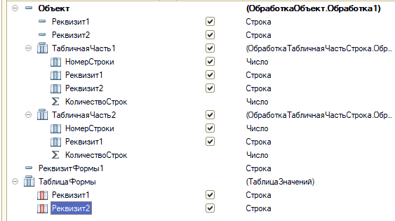
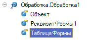
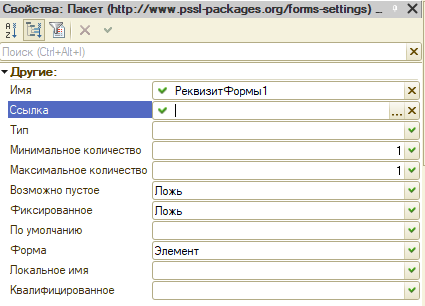
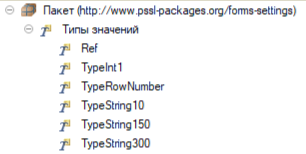
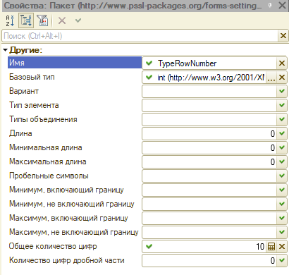

# Подключаемые команды: сохранение и загрузка настроек формы

Подсистема создана для сохранения и восстановления значений реквизитов формы и реквизитов объекта. Сохранение и загрузка происходит посредством выгрузки/загрузки в/из XML-файл по XSD-схеме, указанной в XDTO-пакете "пбп_НастройкиФорм". Подсистему удобно использовать для объектов, значения которых не сохраняются в базе, например, обработок.


## Подключение команд на форму

Чтобы вывести команды на форму, необходимо выполнить следующие действия:
1. Подключить обработчики на нужной форме объекта;
2. Описать структуру формы в XDTO-пакете "пбп_НастройкиФорм";
3. В общем модуле "пбп_ПредопределенныеЗначенияПереопределяемый" определить соответствие формы и типа объекта XDTO-пакета и описать правила конвертации полей при необходимости.

### Подключение обработчиков на форму

В процедуре ПриСозданииНаСервере добавить вызов для добавления команд:
```bsl
&НаСервере
Процедура ПриСозданииНаСервере(Отказ, СтандартнаяОбработка)

    пбп_ПодключаемыеКоманды.ДобавитьСохранениеЗагрузкуНастроекНаФорму(ЭтотОбъект);

КонецПроцедуры
```

В область обработчиков команд формы добавить следующий код:
```bsl copy
#Область ПодключаемыеКоманды

&НаКлиенте
Процедура Подключаемый_ЗагрузитьНастройки(Команда)
	
	пбп_ПодключаемыеКомандыКлиент.ЗагрузитьНастройкиФормы(ЭтотОбъект);
	
КонецПроцедуры

&НаКлиенте
Процедура Подключаемый_ПослеЗагрузкиНастроек(Результат, ДополнительныеПараметры = Неопределено) Экспорт
		
КонецПроцедуры

&НаКлиенте
Процедура Подключаемый_СохранитьНастройки(Команда)
	
	пбп_ПодключаемыеКомандыКлиент.СохранитьНастройкиФормы(ЭтотОбъект);
	
КонецПроцедуры

#КонецОбласти // ПодключаемыеКоманды
```
> [!TIP]
> В процедуре ***Подключаемый_ПослеЗагрузкиНастроек*** можно указать алгоритмы, которые будут выполняться после загрузки файла настроек на форму. Например, дозаполнение элементов на форме, не подлежащих выгрузке, или установка свойств элементов формы, в зависимости от загруженных значений.

### Описание структуры формы

В XDTO-пакет "пбп_НастройкиФорм" необходимо добавить свой тип объекта, содержимое которого будет соответствовать структуре формы.

Для объекта, должно быть создано свойство с типом отдельного объекта, внутри которого будет описание структуры объекта. Для табличных частей должно быть создано свойство с типом отдельного объекта, который будет содержать в себе свойство **Строка**. Строка в свою очередь является отдельным типом объекта, который описывает колонки табличной части.

Подробно о заполнении XDTO-пакета см. [через одну главу](#заполнение-xdto-пакета-настроек-формы).

### Соответствие формы и типа XDTO. Правила конвертации полей

В общем модуле **пбп_ПодключаемыеКомандыПереопределяемый** в функции ***СоответствиеФормыТипаXDTO*** добавляем значение в соответствие "СписокФорм", где ключ соответствия - полное имя формы, а значение - корневой тип элемента пакета XDTO, например:
```bsl
// Добавление
СписокФорм.Вставить("Обработка.пбп_УниверсальнаяЗагрузкаИзФайлаЧерезТабличныйДокумент.Форма.Форма",
    "DataProcessor.UniversalFileDownloadFromTableFile");
// КонецДобавления
```
После этого указать правила конвертации полей в соответствующих методах (подробно см. в [заполнении правил конвертации полей](#заполнение-правил-конвертации-полей)).

## Программный интерфейс

Подсистема включает в себя следующий объекты конфигурации:
1. Общий модуль **ПодключаемыеКоманды** - модуль программного интерфейса серверного контекста, где описана основная логика конвертации данных формы в/из XML-файла. Содержит следующие экспортные методы:
    - Функция ***ПолучитьИмяПространства*** - возвращает URI пространства имен XDTO-пакета "пбп_НастройкиФормы";
    - Процедура ***ДобавитьСохранениеЗагрузкуНастроекНаФорму*** - добавляет команды сохранения и загрузки настроек на форму. Параметр - *ФормаКлиентскогоПриложения*, на которой необходимо добавить команды;
    - Функция ***ЗагрузитьНастройкиФормы*** - выполняет чтение XML-файла при загрузке настроек в структуру, используя типы XDTO-пакета "пбп_НастройкиФормы". Возвращает структуру, в ключе которой находится имя реквизита формы, в значении - значение реквизита формы. Параметры:
        * **ИмяФормы** - *Строка* - полное имя формы;
        * **АдресХранилищаСвойствФормы** - *Строка* - адрес временного хранилища, где находится структура с описанием реквизитов формы. Само описание генерируется в процедуре *ДобавитьСохранениеЗагрузкуНастроекНаФорму*, после чего сохраняется сохраняется во временное хранилище, адрес к которому лежит в реквизите формы "АдресХранилищаСвойствФормы";
        * **АдресФайлаВХранилище** - *Строка* - адрес временного хранилища, где находятся двоичные данные прочитанного файла XML.
    - Функция ***СохранитьНастройкиФормы*** - выполняет запись структуры значений реквизитов формы в XML-файл, используя состав XDTO-пакета "пбп_НастройкиФормы". Возвращает *Строку* адреса временного хранилища, где расположены двоичные данные файла. Параметры:
        * **ИмяФормы** - *Строка* - полное имя формы;
        * **ЗначенияРеквизитов** - *Структура* - значения реквизитов формы, где ключ - имя реквизита, значение - его значение;
> [!NOTE]
> Описание структуры формы представляет из себя структуру в виде дерева, которая генерируется в ***пбп_РаботаСФормами.ПолучитьСвойстваРеквизитовФормыВСтруктуру***. При этом, для объекта, таблицы формы, табличной части объекта создается вложенная структура.
> При наличии реквизитов формы, реквизитов объекта, табличной части объекта и таблицы формы иерархия будет выглядеть следующим образом (ключ - значение):
> 1. РеквизитФормы1 - Строка;
> 2. Объект - Структура:
>     1. РеквизитОбъекта1 - Число;
>     2. РеквизитОбъекта2 - Структура (это табличная часть):
>         1. РеквизитКолонкаТЧ1 - Булево;
> 3. РеквизитФормы2 - Структура (это табличная часть):
>     1. РеквизитКолонкаТЧ1 - Дата.
2. Общий модуль **ПодключаемыеКомандыВызовСервера** - модуль программного интерфейса для вызова сервера, является коннектором клиентского и серверного программного интерфейса подсистемы.
3. Общий модуль **ПодключаемыеКомандыКлиент** - модуль программного интерфейса клиентского контекста:
    - Процедура ***ЗагрузитьНастройкиФормы*** - *асинхронная*. Создает диалог выбора файла загрузки, заполняет данные реквизитов формы, полученные в результате парсинга *ПодключаемыеКоманды.ЗагрузитьНастройкиФормы*. Параметр - *ФормаКлиентскогоПриложения* - форма, с которой происходит вызов команды;
    - Процедура ***СохранитьНастройкиФормы*** - *асинхронная*. Создает диалог сохранения файла, "выгружает" значения реквизитов формы в структуру и сохраняет файл настроек, полученный в результате конвертации *ПодключаемыеКоманды.СохранитьНастройкиФормы*. Параметр - *ФормаКлиентскогоПриложения* - форма, с которой происходит вызов команды;
4. Общий модуль **пбп_ПодключаемыеКомандыСлужебныйКлиентСервер** - модуль служебного программного интерфейса, который содержит вспомогательные функции, доступные и с клиентского, и с серверного контекста:
    - Функция ***СкопироватьСтруктуруЗначенийРеквизитовИзСвойствФормы*** - копирует ключи (без значений) структуры значений реквизитов из свойств формы с преобразованием структуры в массив для таблиц формы. Параметр - *Структура* - структура реквизитов из которой необходимо скопировать ключи. Возвращает *Структуру* со скопированными ключами и пустыми значениями.
    - Функция ***ПолучитьФорматДаты*** - преобразовывает значения двух реквизитов таблицы настроек свойств колонок в одно значение типа "0_0_0". Необходима для конвертации даты при использовании подсистемы [загрузки из файла](ЗагрузкаФайлаЧерезТабличныйДокумент.md#описание-свойств-колонок-файла-макета-посредством-кода). Возвращает строку формата даты в виде 3-ех значений с разделителями. Параметры:
        * **ФорматДатыБезВремени** - *Строка* - строка первых двух разрядов формата - "0_0";
        * **ФорматВремени** - *Число* - номер варианта указания времени: 0 - без времени, 1 - 24-х часовое представление, 2 - 12-часовое представление (AM/PM).
> [!NOTE]
> Функция ***СкопироватьСтруктуруЗначенийРеквизитовИзСвойствФормы*** копирует ключи структуры без значения, но, если в копируемой структуре тип значения ключа является структурой, то в значение подставляется либо *Массив* (подразумевая, что в ключе находится описание табличной части), либо *Структура* - в ней находится описание объекта.

5. Общий модуль **пбп_ПодключаемыеКомандыПереопределяемый** - модуль программного интерфейса. В этом модуле указываются связи формы и типа XDTO-пакета настройки форм, список обработчиков конвертации и правила конвертации полей (по аналогии с "Правилами конвертации свойств" в 1С: Конвертации данных). [Заполнение см. в отдельной главе](#заполнение-правил-конвертации-полей);
6. XDTO-пакет **пбп_НастройкиФорм** - пакет необходим для валидации и конвертации значений реквизитов формы, описания состава выгружаемых/загружаемых полей. [Подробно см. в главе ниже](#заполнение-xdto-пакета-настроек-формы).

## Заполнение XDTO-пакета настроек формы

Структура типа пакета XDTO обязана повторять структуры формы, а именно: соответствия реквизитов формы, объекта, табличных частей и имен свойств типа XDTO с именами реквизитов.

> [!NOTE]
> В пакете могут отсутствовать реквизиты, которые есть на форме - тогда выгрузка и загрузка значений этих реквизитов выполнена не будет. Таким образом можно регулировать состав выгрузки.

Начать "отрисовку" пакета нужно с создания корневого типа, который будет, фактически, соответствовать форме. Для примера возьмем форму абстрактной обработки, которая выглядит следующим образом:



Зададим требования к составу полей: из всех реквизитов формы нам необходимо сохранять значения Реквизит1 Объекта, ТабличнаяЧасть1 Объекта, РеквизитФормы1, ТаблицаФормы.

Создадим корневой тип в пакете:



Как видно из скриншота, в корневом типе указаны только реквизиты верхней иерархии на форме. Для начала рассмотрим подробно свойства полей:



1. **Имя** - имя атрибута. ***Оно должно соответствовать имени реквизита объекта***;
2. **Ссылка** - <u>Не используется в контексте этой подсистемы</u>;
3. **Тип** - тип поля. В этот тип будет конвертироваться (сериализоваться) значение реквизита формы. Поддерживает указание базовых типов из пространства http://www.w3.org/2001/XMLSchema и выбор своих типов значений, объявленных в пространствах имен конфигурации, в том числе локального пакета (подробно см. [в создание типов пакета XDTO](#создание-типов-значений-пакета-xdto));
4. **Минимальное количество** - название говорит само за себя, но также с помощью этого свойства можно устанавливать обязательность поля: если указан 0, то поле необязано находиться в файле (работает как "nullable=true"); в противном случае поле должно быть всегда;
5. **Максимальное количество** - максимальное количество элементов. Для коллекций элементов (по типу табличной части) устанавливается -1, что означет неограниченное количество;
> [!TIP]
> Проще говоря, если поле является обязательным и не является коллекцией, то для него должно быть установлены значения 1:1 (мин:макс количество). Для необязательных полей - 0:1. Для строки коллекции - 0:-1, если она необязательна; 1:-1 - если обязательна.
6. **Возможно пустое** - если Истина, то поле может быть не заполнено;
7. **Фиксированное** - если Истина - объект, должен содержать в данном свойстве указанное значение по умолчанию;
8. **По умолчанию** - фиксированное значение;
9. **Форма** - вид вывода значения поля в файле:
    - *Атрибут* - выводится как тэг в строке объявления типа;
    - *Элемент* - выводится отдельным атрибутом внутри типа;
    - *Текст* - представление свойства в виде содержания элемента XML. <u>Не используется в контексте этой подсистемы</u>;
```xml
// Вид формы "Атрибут" поля "BeginningNumber"
<DataProcessor.UniversalFileDownloadFromTableFile xmlns="http://www.pssl-packages.org/forms-settings" xmlns:xs="http://www.w3.org/2001/XMLSchema" xmlns:xsi="http://www.w3.org/2001/XMLSchema-instance" BeginningNumber="2">
```
```xml
// Вид формы "Элемент" поля "BeginningNumber"
<DataProcessor.UniversalFileDownloadFromTableFile xmlns="http://www.pssl-packages.org/forms-settings" xmlns:xs="http://www.w3.org/2001/XMLSchema" xmlns:xsi="http://www.w3.org/2001/XMLSchema-instance">
    <BeginningNumber>2</BeginningNumber>
</DataProcessor.UniversalFileDownloadFromTableFile>
```
10.  **Локальное имя** - если заполнено это поле, то в файл попадает значение из этого поля. Если не заполнено, то выгружается значение из свойства "Имя";
11.  **Квалифицированное** - определяет необходимость квалификации свойства при сериализации в XML. <u>Не используется в контексте этой подсистемы</u>;

```
### Создание типов значений пакета XDTO

Типы значений необходимы для установки квалификаторов типа: установка минимальной/максимальной длины строки, количество знаков после запятой у числа и т.д. После создания типа значения, ссылку на него можно указывать как "Тип" свойства поля.

> [!NOTE]
> Создание типов значений не является обязательным, но рекомендуемым. Таким образом можно обеспечить защиту от инъекций файла XML: когда файл был изменен напрямую и заполнен неправильным значением. В этом случае, при сериализации мы получим читаемую ошибку о несоответствии типа значения поля файла XSD-схеме. 



Для начала нужно понять, за что отвечает каждое свойство:



1. **Имя** - название типа в пространстве имен;
2. **Базовый тип** - ссылка на тип, на который мы накладываем квалификаторы. Рекомендуется использовать типы пространства http://www.w3.org/2001/XMLSchema, так как пространство является глобальным: универсальными для всех платформ;
3. **Вариант** - вариант содержания типа значения:
    - *Атомарный* - атомарный вариант содержания типа значения. Например, такой вариант имеют строки формата UUID;
    - *Список* - тип значения является списком (других типов). <u>Не используется в контексте этой подсистемы</u>;
    - *Объединение* - тип значения является объединением (других типов). <u>Не используется в контексте этой подсистемы</u>;
4. **Тип элемента** - тип элемента списка, если выбран вариант "Список";
5. **Типы объединения** - типы значений объединения, если выбран вариант "Объединение";
6. **Длина** - квалификатор строки - длина фиксированной строки;
7. **Минимальная длина** - квалификатор строки - минимальная длина строки;
8. **Максимальная длина** - квалификатор строки - максимальная длина строки;
9.  **Пробельные символы** - фасет пробельных символов. <u>Не используется в контексте этой подсистемы</u>;
10. **Минимум, включающий границу** - Фасет минимального включающего значения. <u>Не используется в контексте этой подсистемы</u>;
11. **Минимум, не включающий границу** - Фасет минимального исключающего значения. <u>Не используется в контексте этой подсистемы</u>;
12. **Максимум, включающий границу** - Фасет максимального включающего значения. <u>Не используется в контексте этой подсистемы</u>;
13. **Максимум, не включающий границу** - Фасет максимального исключающего значения. <u>Не используется в контексте этой подсистемы</u>;
14. **Общее количество цифр** - квалификатор числа - общее количество цифр включая дробную часть (после запятой);
15. **Количество цифр дробной части** - квалификатор числа - количество цифр дробной части (после запятой);

> [!TIP]
> Для простоты понимая фасетов общего количество цифр и количество цифр дробной части соответствует первому и втором квалификатору числа описания типов.
```

Продолжаем

## Заполнение правил конвертации полей


## Запланированные к реализации функции

- [ ] [Добавление полей поиска в конвертацию ссылок](https://github.com/firstBitSportivnaya/PSSL/issues/258)
- [ ] [Выгрузка настроек из формы списка по объектам](https://github.com/firstBitSportivnaya/PSSL/issues/259)