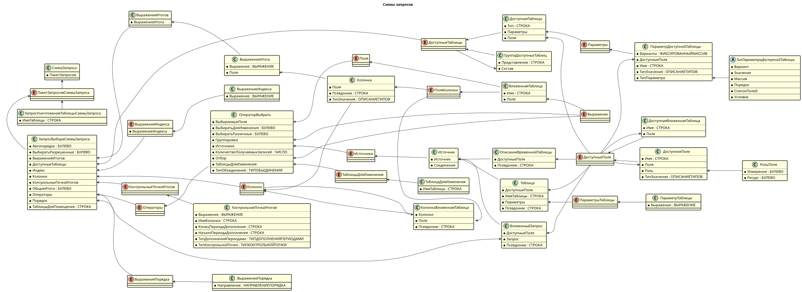

# Подсистема "схемы запросов"

## Описание подсистемы

Встроенный язык 1С позволяет использовать текстовые запросы для извлечения данных из базы. Однако зачастую требуется динамически изменять текст запросов в зависимости от условий алгоритма. Это может включать добавление новых условий, полей выборки или модификацию существующих параметров.

Подсистема ``Схемы запросов`` предоставляет удобный интерфейс для работы с текстами запросов через объектную модель, позволяя:

- Избежать прямого редактирования текста запроса.
- Улучшить читаемость и поддержку кода.
- Минимизировать вероятность ошибок, связанных с изменением текстов запросов.



## Требования для работы со схемой запросов

- Сохранение родительских объектов
Для корректного использования объектов схемы запроса их родительские объекты должны оставаться существующими. Например, нельзя получить объект **``ПоляСхемыЗапроса``** из **``ОператорВыбратьСхемыЗапроса``**, затем удалить этот оператор из **``ЗапросВыбораСхемыЗапроса``** и после этого пытаться добавить новые выражения в **``ПоляСхемыЗапроса``**.

- Уникальность объектов схемы запроса
Объекты, полученные из одной схемы запроса, не могут быть использованы в другой схеме.

## Примеры использования

**Пример 1: Добавление условия отбора**
Неправильно:
Вставка условия с использованием СтрЗаменить увеличивает объем кода и снижает читаемость. Возможна ситуация когда фрагмент кода ``НЕ пбп_ПредопределенныеЗначения.ПометкаУдаления`` используется не только в секции ``ГДЕ``

```BSL 
Если пбп_ОбщегоНазначенияПовтИсп.ПолучитьЗначениеКонстанты("пбп_ИспользоватьПользовательскиеФункции") Тогда
    Запрос.Текст = СтрЗаменить(Запрос.Текст, "НЕ пбп_ПредопределенныеЗначения.ПометкаУдаления",
        "НЕ пбп_ПредопределенныеЗначения.ПометкаУдаления
        |пбп_ПредопределенныеЗначения.ИдентификаторНастройки <> """"");
КонецЕсли;
```

Правильно:
Используйте функцию ``ДобавитьОтборВЗапрос``, чтобы вставить условие в секцию ``ГДЕ``:
```BSL 
Если пбп_ОбщегоНазначенияПовтИсп.ПолучитьЗначениеКонстанты("пбп_ИспользоватьПользовательскиеФункции") Тогда
    Запрос.Текст = пбп_СхемыЗапросов.ДобавитьОтборВЗапрос(Запрос.Текст,
        "пбп_ПредопределенныеЗначения.ИдентификаторНастройки <> """"");
КонецЕсли;
```

**Пример 2: Множественное добавление полей выборки**

Для динамического формирования списка полей можно использовать функцию ``ДобавитьПоляВыборкиВЗапрос``.
```BSL
Запрос.Текст = 
    "ВЫБРАТЬ
    |	пбп_ПредопределенныеЗначения.Ссылка КАК Ссылка
    |ИЗ
    |	%1 КАК пбп_ПредопределенныеЗначения
    |ГДЕ
    |	пбп_ПредопределенныеЗначения.Ссылка В(&СписокПредопределенных)";

Поля = Новый СписокЗначений;
Поля.Добавить("пбп_ПредопределенныеЗначения.СписокЗначений", "Список значений");
Поля.Добавить("пбп_ПредопределенныеЗначения.Пароль", "Пароль");

Запрос = пбп_СхемыЗапросов.ДобавитьПоляВыборкиВЗапрос(Запрос, Поля);
```

**Пример 3: Установить количество получаемых записей**

Пример:
```BSL
Запрос.Текст = 
    "ВЫБРАТЬ
    |    пбп_ИсторияИнтеграции.Ссылка КАК Ссылка
    |ИЗ
    |    Справочник.пбп_ИсторияИнтеграции КАК пбп_ИсторияИнтеграции
    |;
    |
    |////////////////////////////////////////////////////////////////////////////////
    |ВЫБРАТЬ
    |    пбп_СоответствияОбъектовИБ.Объект1 КАК Объект1
    |ИЗ
    |    РегистрСведений.пбп_СоответствияОбъектовИБ КАК пбп_СоответствияОбъектовИБ";
```

Необходимо наложить ограничение по количеству записей на первый пакет запроса.
Неправильно:
```BSL 
Запрос.Текст = СтрЗаменить(Запрос.Текст, "ВЫБРАТЬ
    |    пбп_ИсторияИнтеграции.Ссылка",
    "ВЫБРАТЬ ПЕРВЫЕ 1
    |    пбп_ИсторияИнтеграции.Ссылка");
```

Правильно:
Используйте функцию ``УстановитьКоличествоПолучаемыхЗаписей``, чтобы установить количество получаемых записей:
```BSL 
Запрос = пбп_СхемыЗапросов.УстановитьКоличествоПолучаемыхЗаписей(Запрос, 1, 0);
```

**Пример 4. Добавление условий в виртуальную таблицу**
```BSL 
Запрос.Текст = "ВЫБРАТЬ
|	ТестОстатки.Склад КАК Склад,
|	ТестОстатки.КоличествоОстаток КАК КоличествоОстаток
|ИЗ
|	РегистрНакопления.Тест.Остатки(&Дата, ) КАК ТестОстатки
```

Неправильно:
```BSL 
Запрос.Текст = СтрЗаменить(Запрос.Текст, "(&Дата, )", "(&Дата, Склад = &Склад)");
```

Правильно:
Используйте функцию ``ДобавитьУсловиеВЗапрос``:
```BSL 
Запрос = пбп_СхемыЗапросов.ДобавитьУсловиеВЗапрос(Запрос, "Склад = &Склад");
```

**Пример 5. Работа с пакетами**

```BSL
ТекстЗапроса =
    "ВЫБРАТЬ
    |	пбп_ПредопределенныеЗначения.Ссылка КАК Ссылка,
    |	пбп_ПредопределенныеЗначения.СписокЗначений КАК СписокЗначений,
    |	пбп_ПредопределенныеЗначения.Пароль КАК Пароль,
    |	пбп_ПредопределенныеЗначения.Значение КАК Значение,
    |	пбп_ПредопределенныеЗначения.ИдентификаторНастройки КАК Идентификатор
    |ПОМЕСТИТЬ Предопределенные
    |ИЗ
    |	ПланВидовХарактеристик.пбп_ПредопределенныеЗначения КАК пбп_ПредопределенныеЗначения
    |ГДЕ
    |	пбп_ПредопределенныеЗначения.ИдентификаторНастройки В(&Идентификаторы)
    |;
    |
    |////////////////////////////////////////////////////////////////////////////////
    |ВЫБРАТЬ
    |	ПредопределенныеЗначения.Ссылка КАК Ссылка,
    |	ПредопределенныеЗначения.СписокЗначений КАК СписокЗначений,
    |	ПредопределенныеЗначения.Пароль КАК Пароль,
    |	ВЫБОР
    |		КОГДА ПредопределенныеЗначения.СписокЗначений
    |			ТОГДА пбп_ПредопределенныеЗначенияЗначенияЭлементов.Значение
    |		КОГДА НЕ ПредопределенныеЗначения.Пароль
    |			ТОГДА ПредопределенныеЗначения.Значение
    |		ИНАЧЕ """"
    |	КОНЕЦ КАК Значение,
    |	ПредопределенныеЗначения.Идентификатор КАК Идентификатор
    |ПОМЕСТИТЬ ЗначенияПредопределенных
    |ИЗ
    |	Предопределенные КАК ПредопределенныеЗначения
    |		ЛЕВОЕ СОЕДИНЕНИЕ %1.ЗначенияЭлементов КАК пбп_ПредопределенныеЗначенияЗначенияЭлементов
    |		ПО ПредопределенныеЗначения.Ссылка = пбп_ПредопределенныеЗначенияЗначенияЭлементов.Ссылка
    |;
    |
    |////////////////////////////////////////////////////////////////////////////////
    |ВЫБРАТЬ
    |	ЗначенияПредопределенных.Значение КАК Значение,
    |	ЗначенияПредопределенных.Идентификатор КАК Идентификатор
    |ИЗ
    |	ЗначенияПредопределенных КАК ЗначенияПредопределенных
    |ГДЕ
    |	ЗначенияПредопределенных.СписокЗначений
    |	И НЕ ЗначенияПредопределенных.Значение ЕСТЬ NULL
    |ИТОГИ ПО
    |	Идентификатор
    |;
    |
    |////////////////////////////////////////////////////////////////////////////////
    |ВЫБРАТЬ
    |	ЗначенияПредопределенных.Ссылка КАК Ссылка,
    |	ЗначенияПредопределенных.Пароль КАК Пароль,
    |	ЗначенияПредопределенных.Значение КАК Значение,
    |	ЗначенияПредопределенных.Идентификатор КАК Идентификатор
    |ИЗ
    |	ЗначенияПредопределенных КАК ЗначенияПредопределенных
    |ГДЕ
    |	НЕ ЗначенияПредопределенных.СписокЗначений";

ТекстЗапроса = пбп_СхемыЗапросов.ДобавитьОтборВЗапрос(ТекстЗапроса, "НЕ пбп_ПредопределенныеЗначения.ПометкаУдаления", 0);

ТекстЗапроса = пбп_СхемыЗапросов.ДобавитьОтборВЗапрос(ТекстЗапроса, "ЗначенияПредопределенных.Идентификатор <> """", 3);
```