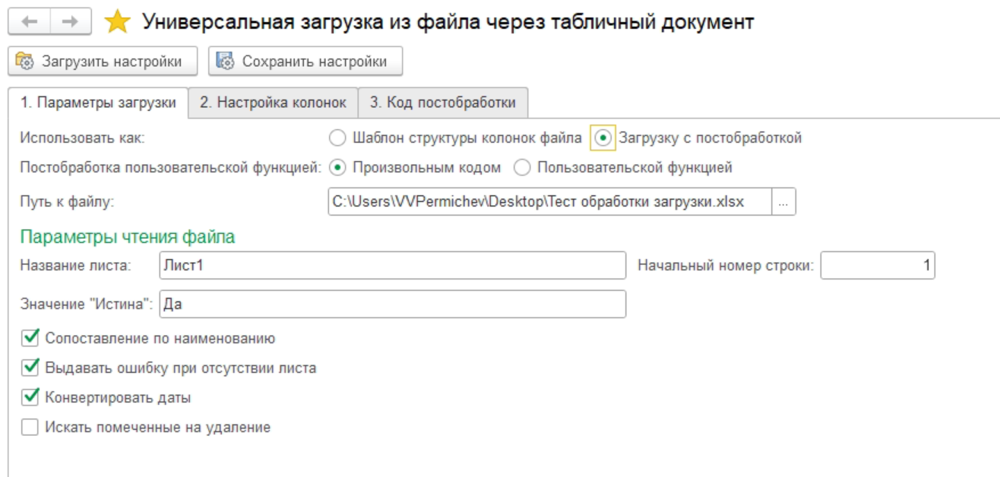
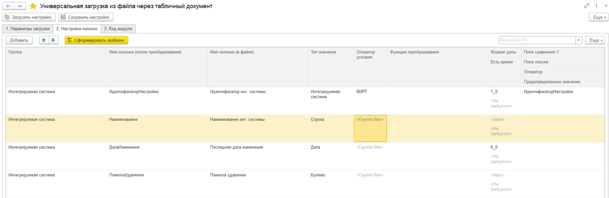
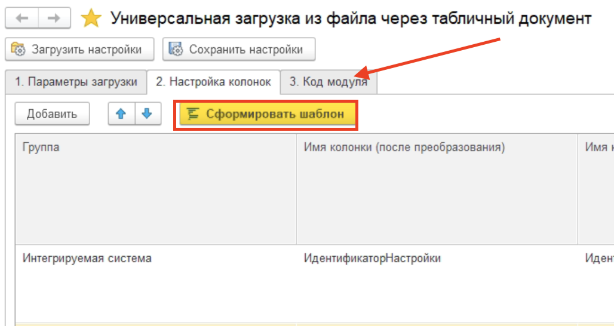
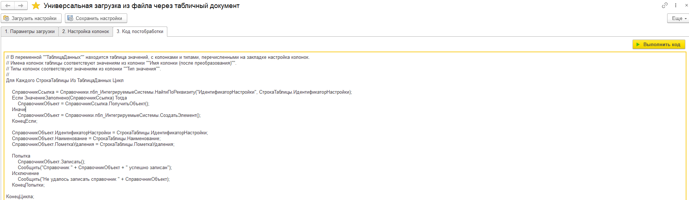
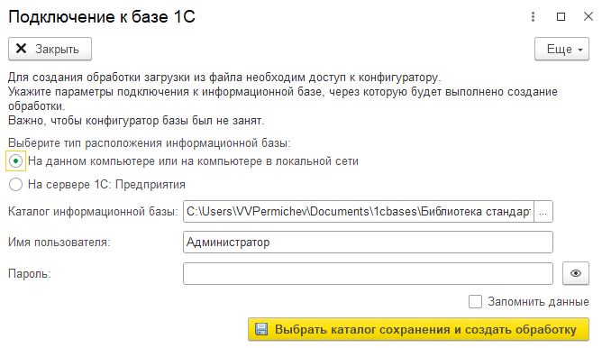
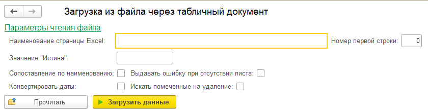

# Обработка универсальной загрузки из файла через табличный документ



Предназначена для создания структуры шаблона таблицы для загрузки файла через табличный документ в пользовательском режиме, а также загрузки данных из самой обработки с использованием пользовательской функции или с помощью произвольного кода для пост-обработки полученных парсингом данных.

Также имеет функционал для создания внешней обработки с базовыми функциями: выбора файла, отрисовки содержимого табличного файла Excel на форме обработки и каркаса для алгоритма пост-обработки полученных данных.

> [!TIP]
> К данной форме подключены команды сохранения и загрузки настроек формы, чтобы сохранять сценарии загрузки файлов через табличный документ. По нажатию на кнопку "Сохранить настройки" происходит сохранение значений реквизитов формы в XML-файл, который можно загрузить из формы (по нажатию на кнопку "Загрузить настройки") для восстановления значений полей. Подробнее см. [Подключаемые команды: сохранение и загрузка настроек формы](ПодключаемыеКомандыНастройкиФормы.md)

## Заполнение настройки колонок

Для того, чтобы данные файла были сконвертированы корректно, необходимо заполнить страницу "Настройка колонок":



Таблица настроек повторяет описание свойств колонок файла из **пбп_ЗагрузкаФайлаЧерезТабличныйДокументСервер.ИнициализироватьТаблицуСоСвойствамиКолонок()** ([подробное описание см. в Загрузка файла через табличный документ](ЗагрузкаФайлаЧерезТабличныйДокумент.md#описание-свойств-колонок-файла-макета-посредством-кода)):
1. **Группа** - _Строка_ - группа колонок таблицы;
2. **Имя колонки (после преобразования)** - _Строка_  - имя колонки в будущей таблице значений, которая будет получена конвертацией данных;
3. **Имя колонки (в файле)** - _Строка_ - наименование колонки в шапки таблицы;
4. **Тип значения** - _ОписаниеТипов_ - тип значений колонки;
5. **Оператор условия** - _Строка_ - список из значений: "Группа Или" (по умолчанию), "Группа И", "Виртуальное поле" - оператор условия соединения с таблицей типа значения. По умолчанию - ИЛИ;
6. **Функция преобразования** - _Строка_ - экспортная функция серверного контекста (общий модуль, модуль менеджера и т.д.) для преобразования данных значения колонки;
7. **Формат даты** - _Строка_ - формат даты: числа с разделителями. Например, "0_0_0" или "3_1_1";
8. **Есть время** - _Число_ - список из значений: "Не требуется", "24-х часовое", "12-ти часовое (AM/PM)";
9. **Поле поиска** - _Строка_ - название реквизита типа по которому будет происходить сопоставление;
10. **Оператор** - _Строка_ - оператор условия сравнения полученного при парсинге значения и поля поиска объекта. По умолчанию - "=";
11. **Предопределенное значение** - _Строка_ - предопределенное значение конфигурации: значение перечисления, предопределенный элемент справочника и т.д.;

## Создание структуры шаблона таблицы для использования в подсистеме "Загрузка файла через табличный документ"

Для того, чтобы создать описание свойств колонок загружаемого файла, на странице параметры загрузки в поле "Использовать как" необходимо выбрать значение "Шаблон структуры колонок файла".

Предусмотрено три варианта создания шаблона в соответствие с возможностями подсистемы загрузки файла через табличный документ: в виде кода, макета и ([внешней обработки](#создание-внешней-обработки-загрузки-данных)).

После указания необходимого типа шаблона, нужно [заполнить таблицу настроек колонок](#заполнение-настройки-колонок), после чего нажать на кнопку "Сформировать шаблон" - на странице "Код модуля" или "Макет" (в зависимости от выбранного варианта) будет сформирован шаблон структуры:



После чего скопировать полученный код (макет) и поместить его в необходимый модуль (табличный документ).

## Загрузка данных из файла через обработку

Для того чтобы использовать обработку для загрузки данных из файла, необходимо установить флаг "Использовать как" в значение "Загрузку с постобработкой". Далее, в поле "Постобработка" указать вариант пост-обработки данных. Обработка поддерживает два варианта пост-обработки: с помощью пользовательских функций и произвольного кода. В поле "Пост-обработка" выбираем необходимый вариант. Если выбран вариант обработки пользовательской функцией, то появится поле с указанием ссылки пользовательской функции. Если выбран вариант обработки произвольным кодом, то в обработке появится отдельная страница для ввода текста кода.

> [!WARNING]
> Пост-обработка пользовательской функцией доступна только при включенной функциональной опции "Использовать пользовательские функции".

Помимо заполнения настройки колонок, которая была описана ранее, на странице параметров загрузки потребуется указать путь к загружаемому файлу (табличный файл с расширением XLSX), а также заполнить параметры чтения файла ([подробное описание см. в Загрузка файла через табличный документ](ЗагрузкаФайлаЧерезТабличныйДокумент.md#параметры-чтения-файла)):

1. **Название листа** - наименование листа табличного файла;
2. **Начальный номер строки** - номер строки, с которого следует начать чтение данных файла;
3. **Значение "Истина"** - представление значения колонки, которое будет конвертировано как "Истина" для колонок с типом "Булево";
4. **Сопоставление по наименованию** - колонки сопоставляются по имени колонки, указываемое в настройках колонок. В противном случае, сопоставляется по порядку;
5. **Выдавать ошибку при отсутствии листа** - если лист, с указанным в "Названии листа" именем не найден, то будет вызвана ошибка и чтение прервано;
6. **Конвертировать даты** - даты будут конвертированы, в ином случае останутся строкой;
7. **Искать помеченные на удаление** - при поиске ссылок на объект учитывать помеченные на удаление.

Если выбран вариант постобработки пользовательской функцией, то необходимо заполнить ссылку на пользовательскую функцию в поле "Функция постобработки данных", где будет указан алгоритм обработки данных ([подробно см. в Пользовательские функции](ПользовательскиеФункции.md)). Например, по данным из документа необходимо создать интегрируемую систему:

```bsl
Для Каждого СтрокаТаблицы Из ТаблицаДанных Цикл

    СправочникСсылка = Справочники.пбп_ИнтегрируемыеСистемы.НайтиПоРеквизиту(
        "ИдентификаторНастройки", СтрокаТаблицы.ИдентификаторНастройки);
    Если ЗначениеЗаполнено(СправочникСсылка) Тогда
        СправочникОбъект = СправочникСсылка.ПолучитьОбъект();
    Иначе
        СправочникОбъект = Справочники.пбп_ИнтегрируемыеСистемы.СоздатьЭлемент();
    КонецЕсли;

    СправочникОбъект.ИдентификаторНастройки = СтрокаТаблицы.ИдентификаторНастройки;
    СправочникОбъект.Наименование = СтрокаТаблицы.Наименование;
    СправочникОбъект.ПометкаУдаления = СтрокаТаблицы.ПометкаУдаления;

    Попытка
        СправочникОбъект.Записать();
        Сообщить("Справочник " + СправочникОбъект + " успешно записан");
    Исключение
        Сообщить("Не удалось записать справочник " + СправочникОбъект);
    КонецПопытки;

КонецЦикла;

Результат = Истина;
```

> [!NOTE]
> В пользовательской функции в параметре **ТаблицаДанных** находится таблица значений конвертированных из документа данных с именами колонок и типами, указанными на странице настройки колонок.

Для обработки данных произвольным кодом, необходимо заполнить код текстом на странице "Код постобработки" и нажать на кнопку "Выполнить код":



## Создание внешней обработки загрузки данных

Из обработки можно создать экземпляр внешней обработки загрузки данных, с указанными на странице "Настройки колонок" данными. Для этого необходимо во флаге "Использовать как" поставить значение "Шаблон структуры колонок файла", а в поле "Шаблон в виде" - "Внешней обработки".

После указания структуры свойств колонок, нажать на кнопку "Сформировать шаблон". После этого откроется окно подключения к другой базе 1С - это нужно создания внешней обрабокти из-под конфигуратора, запущенного в пакетном режиме:



> [!WARNING]
> Конфигуратор указываемой базы должен быть не занят на время создания внешней обработки.

> [!TIP]
> Значения подключения базы можно сохранить в безопасном хранилище. Для этого необходимо установить галку "Запомнить данные" перед нажатием на кнопку "Выбрать каталог...".

После нажатия на кнопку "Выбрать каталог сохранения и создать обработку" будет вызван диалог выбора каталога сохранения: внешняя обработка будет создана по указанному пути.



Для загрузки данных необходимо открыть внешнюю обработку в конфигураторе и заполнить код обработки данных в процедуре формы **ЗагрузитьНаСервере()**. В переменной **ТаблицаРезультат** находится таблица значений конвертированных из документа данных с именами колонок и типами, указанными на странице настройки колонок.

После сохранения обработки открыть ее в пользовательском интерфейсе, заполнить параметры чтения файла ([см. подробное описание](#загрузка-данных-из-файла-через-обработку)), нажать на кнопку прочитать и выбрать нужный файл. На форме будет сформирован табличная часть с конвертированными значениями. Для загрузки данных нажать на кнопку "Загрузить данные".