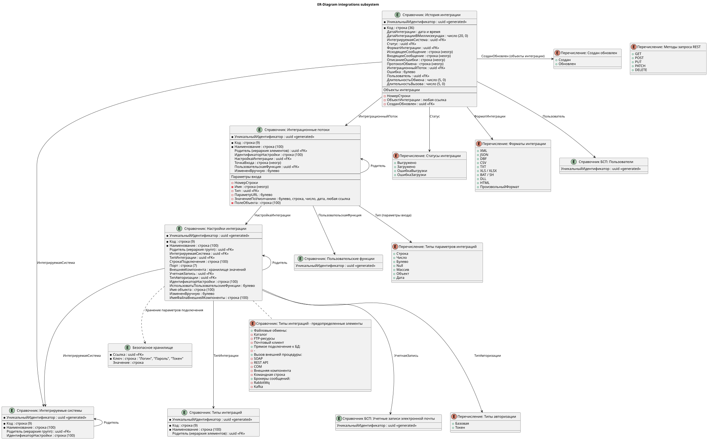
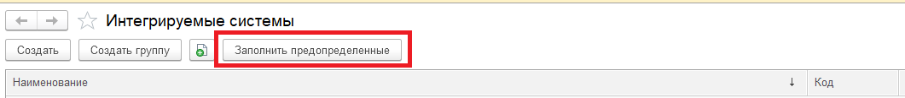

# Подсистема "Управление интеграциями"

## Общие сведения

Подсистема предназначена для хранения и управления настройками интеграций разных типов:
- **Файловые обмены**;
- **Прямое подключение к базе данных**;
- **Вызов внешней процедуры**;
- **Брокеры сообщений**.

Содержит в себе функции для взаимодействия с указанными типами интеграций. Содержит в себе функции для логирования вызовов интеграций.

## Состав подсистемы



1. Справочники
    - **пбп_ИнтегрируемыеСистемы** - верхнеуровневый справочник, хранящий в себе наименования интегрируемых систем;
    - **пбп_ТипыИнтеграций** - содержит в себе перечень предопределенных"*" типов интеграций, под которые выполняются настройки. Необходим для определения варианта настроек,
    состава показываемых полей, определения функций взаимодействия с конечной системой;
    - **пбп_НастройкиИнтеграции** - справочник, предназначенный для хранения настроек подключения и аутентификации в системе. Форма настроек параметризируется в зависимости от выбранного типа интеграции;
    - **пбп_ИнтеграционныеПотоки** - хранит в себе данные о точке входа в интегрируемую систему (ресурс REST, интерфейс SOAP, команду BASH / CMD и пр.), а также передаваемые параметры и аргументы. При внедрении с подсистемой пользовательских функций присутствует возможность настроить регламентное задание ("пбп_ВыполнениеПользовательскихФункцийФайловыхОбменов") для отправки / получения данных, используя пользовательские функции;
    - **пбп_ИсторияИнтеграции** - для логирования вызовов интеграционных потоков. Содержит информацию о входящем / исходящем запросе, задействованных в процессе вызова объектов, протокол вызова, метрики длительности обмена и вызова и т.д.. Для периодической очистки истории интеграций существует регламентное задание "пбп_ОчисткаИсторииИнтеграции";

2. Определяемые типы
    - **пбп_Пользователи** - ссылка на справочник пользователей (БСП). При внедрении в конфигурацию с БСП, необходимо добавить в состав "СправочникСсылка.Пользователи";
    - **пбп_УчетныеЗаписиЭлектроннойПочты** - ссылка на справочник учетных записей электронной почты (БСП). При внедрении в конфигурацию с БСП, необходимо добавить в состав "СправочникСсылка.УчетныеЗаписиЭлектроннойПочты";

3. Регламентные задания
    - **пбп_ОчисткаИсторииИнтеграции** - периодическая очистка справочника "пбп_ИсторияИнтеграции". Для успешных вызовов и вызовов с ошибкой можно настроить разное количество дней хранения логов. Для этого необходимо выставить разное количество дней у элементов "Количество дней хранения истории интеграции" и "Количество дней хранения ошибок истории интеграции" в плане видов характеристик "пбп_ПредопределенныеЗначения" соответственно.
    - **пбп_ВыполнениеПользовательскихФункцийФайловыхОбменов** - ***доступно только при наличии подсистемы пользовательских функций!*** Настройка расписания выполнения пользовательских функций в разрезе интеграционного потока для формирования сообщения получения / отправки файловых интеграций (с локальной / сетевой папкой, ftp / sftp и т.д.). Логика формирования сообщения должна быть заполнена в справочнике "пбп_Пользовательские функции" (см. [Пользовательские функции](ПользовательскиеФункции.md));

4. Общие макеты
    - **пбп_JSONEditor** - содержит web-приложение для вставки в html поле для форматирования в JSON-формат в виде дерева или структуры;
    - **пбп_XMLEditor** - содержит web-приложение для вставки в html поле для форматирования в XML-формат в виде дерева;
    - **пбп_PinkRabbitMQ** - содержит архив с компонентой подключения и взаимодействия с брокером сообщений Rabbit Mq (см. [PinkRabbitMQ library](https://github.com/BITERP/PinkRabbitMQ));
    - **пбп_SimpleKafkaAdapter** - содержит архив с компонентой подключения и взаимодействия с брокером сообщений Kafka (см. [Simple Kafka Connector 1C](https://github.com/NuclearAPK/Simple-Kafka_Adapter));

5. Общие модули
    - **пбп_ИнтеграцииСервер** - модуль программного интерфейса, где описана серверная логика и функции взаимодействия с другими системами (подробно см. в главе [Реализованные методы](#реализованные-методы));
	- **пбп_ИнтеграцииСлужебный** - модуль служебного программного интефейса, где описана логика взаимодействия с объектами подсистемы, а также вспомогательные экспортные функции (подробно см. в главе [Служебный программный интерфейс](#служебный-программный-интерфейс));
	- **пбп_ИнтеграцииFTPSFTP** - модуль программного интерфейса, где описана серверная логика и функции взаимодействия с FTP и SFTP серверами (подробно см. в главе [Реализованные методы](#реализованные-методы));
    - **пбп_КоннекторHTTP** - модуль программного интерфейса, предоставляющий удобную обертку вызовов REST-методов HTTP-сервисов (см. [Коннектор: удобный HTTP-клиент](https://github.com/vbondarevsky/Connector));
	- ***пбп_МетодыРегламентныхЗаданийСервер** - модуль программного интерфейса, являющийся "единым хранилищем" экспортных методов регламентных заданий;
     
"*" В рамках общего отказа от предопределенных значений в справочниках ПБП необходимо уточнение: предопределенные значения справочника **пбп_ТипыИнтеграций** используются по причине того, что в них перечислены общие, стандартизированные и широкоиспользумые типы, которые, в свою очередь, влиют на параметризацию справочников **пбп_НастройкиИнтеграции**, **пбп_ИнтеграционныеПотоки** и **пбп_ИсторияИнтеграции**.

## Ролевая модель

Для создания и настройки объектов подсистемы управление интеграциями существует роль **пбп_РедактированиеНастроекИнтеграции**.
Для просмотра справочника истории интеграции существует роль **пбп_ПросмотрИсторииИнтеграции**.

## Связанные подсистемы

1. [Предопределенные значения](docs/ПредопределенныеЗначения.md)
2. [Переопределения методов БСП](docs/ПереопределениеМетодовБСП.md)
3. [Пользовательские функции](docs/ПользовательскиеФункции.md)
4. [Загрузка файла через табличный документ](docs/ЗагрузкаФайлаЧерезТабличныйДокумент.md)

## Порядок взаимодействия

Взаимодействие с подсистемой будет отличаться для разных типов интеграции, но можно выделить общие шаги для любого типа:
1. После определения типа интеграции, необходимо заполнить информацию о настройках в справочниках подсистемы. Для создания настроек интеграции необходимо создать предопределенные элементы справочников **пбп_ИнтегрируемыеСистемы**, **пбп_НастройкиИнтеграции**, **пбп_ИнтеграционныеПотоки** с помощью подсистемы предопределенных значений (см. [Предопределенные значения](docs/ПредопределенныеЗначения.md)). Создание не предопределенных потоков <ins>допускается только в случае файловых обменов при использовании пользовательских функций</ins>;
2. Если это "предопределенная" интеграция (без использования пользовательской функции), то вызов должен быть обернут в запись в справочник истории интеграции для хранения в нем логов;
3. Подбор и реализация вызова нужного метода интеграции в зависимости от ее типа;
4. Пост-обработка полученного в п.3 результата вызова;
5. Запись лога обмена в справочник истории интеграции;

### Заполнение предопределенных значений настроек

Для заполнения предопределенных значений необходимо перейти в общий модуль "пбп_ПредопределенныеЗначенияПереопределяемый". В соответствующих объектам метаданных процедурах добавить строки в таблицу предопределенных по обязательным полям:
```bsl
Процедура ПредопределенныеЗначенияИнтегрируемыеСистемы(Таблица) Экспорт

   // Добавление
   НоваяСистема = Таблица.Добавить();
   НоваяСистема.Наименование           = "Система N";
   НоваяСистема.ИдентификаторНастройки = "СистемаN";
   // КонецДобавления

КонецПроцедуры

Процедура ПредопределенныеЗначенияНастройкиИнтеграции(Таблица) Экспорт
    
   // Добавление
   НоваяНастройка = Таблица.Добавить();
   НоваяНастройка.Наименование           = "Интеграция с системой N";
   НоваяНастройка.ИдентификаторНастройки = "ИнтеграцияССистемойN";
   // Параметром передается идентификатор настройки интегрируемой системы
   НоваяНастройка.ИнтегрируемаяСистема   = пбп_ИнтеграцииСлужебный.ИнтегрируемаяСистема("СистемаN");
   // Заполняем необходимый тип интеграции из предопределенных значений справочника, например "SFTP"
   НоваяНастройка.ТипИнтеграции          = Справочники.пбп_ТипыИнтеграций.SFTP;
   // Указываем тип авторизации. Для большинства типов интеграций - это базовая.
   // Для интеграций с типом "брокеры сообщений", "REST API" и "SOAP" доступна авторизация через bearer-токен (JWT-токен)
   НоваяНастройка.ТипАвторизации         = Перечисления.пбп_ТипыАвторизации.Базовая;
   // КонецДобавления

КонецПроцедуры

Процедура ПредопределенныеЗначенияИнтеграционныеПотоки(Таблица) Экспорт

   // Добавление
   НовыйМетод = Таблица.Добавить();
   НовыйМетод.Наименование           = "Интеграционный поток системы N";
   НовыйМетод.ИдентификаторНастройки = "ИнтеграционныйПотокСистемыN";
   // Направление потока служит логическим разделением потоков по отношению к системе-корреспонденту:
   // Исходящий - ИС-отправитель - наша система, ИС-получатель - сторонняя;
   // Входящий - ИС-отправитель - сторонняя система, ИС-получатель - наша;
   // Служебный - для служебных методов, по типу отправки оповещений / логов / очистки файлов и т.д.
   НовыйМетод.НаправлениеПотока      = Перечисления.пбп_НаправленияИнтеграционныхПотоков.Исходящий;
   // КонецДобавления

КонецПроцедуры
```
Идентификатор настройки каждого объекта должен быть уникальным в рамках одного типа метаданных.
После инициализации и заполнения предопределенных элементов в коде, необходимо зайти в пользовательский режим в формы списков соответствующих справочников и нажать на кнопку "Заполнить предопределенные" в следующей последовательности: интегрируемые системы, настройки интеграции, интеграционные потоки:



### Служебный программный интерфейс

Как видно из прошлого примера (заполнения предопределенных значений настройки интеграции), для поиска интегрируемой системы по идентификатору настройки вызывается метод общего модуля пбп_ИнтеграцииСлужебный. Помимо данной функции в этом модуле служебного программного интерфейса реализована следующая логика и методы:

1. **Работа с историей интеграции**:
* ПолучитьСтруктуруЗаписиИстории - возвращает структуру со всеми необходимыми значениями для заполнения записи истории интеграции;
* СоздатьСообщениеИсторииИнтеграции - создает запись справочника История интеграции с информацией о событии интеграции (лог). В первом параматре передается заполненная структура, полученная из функции ПолучитьСтруктуруЗаписиИстории;
* ДобавитьЗаписьВПротоколОбмена - дополняет значение ключа "ПротоколОбмена" структуры строкой события через разделитель, полученной из функции ПолучитьСтруктуруЗаписиИстории. В первом параметре передается структура записи истории, во втором - текст добавляемого сообщения, в третьем - разделитель (по-умолчанию: '";" + Символы.ПС');
* ПолучитьПредставлениеТекстЗапросаВнешнегоИсточникаДанных - возвращает представление текста запроса для внешнего источника данных. Вместо имен параметров запроса в его тексте подставляются значения параметров. Первым параметром передается запрос, который необходимо конвертировать в строку;
2. **Работа с данными подсистемы**:
* ПолучитьСтруктуруНастроекИнтеграции - возвращает структуру со значениями реквизитов настроек интеграции, включая данные безопасного хранилища (логин, пароль / токен). В параметре указывается ссылка на настройку интеграции;
* ПолучитьСтруктуруПотокаИНастроекИнтеграции - аналогично предыдущей функции, но получает данные по интеграционному потоку, добавляя в структуру данные по точке входа. В параметр передается ссылка на интеграционный поток;
* ПолучитьСтруктуруПараметровВхода - возвращает структуру, полученную из реквизитов табличной части "ПараметрыВхода" интеграционного потока. Вторым параметром указывается заполнять значения по умолчанию для параметров или нет. В случае, если параметры заполняются по умолчанию, то каждой строке параметра будет выведено значение, заполненное в табличной части, конвертированное в JSON-формат (булево: "true" или "false"; дата: "yyyy-MM-dd" и т.д.). В противном случае, значение будет конвертировано в тип 1С, указанный в колонке "Тип" табличной части;
* ИнтеграционныйПоток - возвращает интеграционный поток по идентификатору настройки;
* ИнтегрируемаяСистема - возвращает интегрируемую систему по идентификатору настройки;
* НастройкаИнтеграции - возвращает настройку интеграции по идентификатору настройки;

### Заполнение истории интеграции

Рассмотрим заполнение данных на примерах по типам интеграций:

### Файловые интеграции

### Прямое подключение к базе данных

### Вызов внешней процедуры

### Брокеры сообщений

#### Заполнение настроек для обмена через FTP-Сервер
Заходим в общий модуль "пбп_ПредопределенныеЗначенияПереопределяемый" и добавляем следующий код:
1. В функции ПредопределенныеЗначенияИнтегрируемыеСистемы, необходимо добавить интегрируемую систему, с которой будет происходить взаимодействие

```bsl
Функция ПредопределенныеЗначенияИнтегрируемыеСистемы() Экспорт
	
	Результат = ТаблицаПредопределенныхИнтегрируемыеСистемы();
	
	// Добавление
	НоваяСистема = Результат.Добавить();
	НоваяСистема.Наименование = "FTP-Сервер";
	НоваяСистема.ИдентификаторНастройки = "FTPСервер";
	// КонецДобавления
	
	Возврат Результат;
	
КонецФункции
```

2. В функции ПредопределенныеЗначенияНастройкиИнтеграции, необходимо добавить настройки интеграции, по которым выполняется подключение к ранее добавленной системе, с  указанием ссылки на интегрируемую систему

```bsl
Функция ПредопределенныеЗначенияИнтегрируемыеСистемы() Экспорт
	
	Результат = ТаблицаПредопределенныхНастройкиИнтеграции();
	
	// Добавление
	НоваяНастройка = Результат.Добавить();
	НоваяНастройка.Наименование = "Подключение к ftp-серверу";
	НоваяНастройка.ИдентификаторНастройки = "ИнтеграцияЧерезFTP";
    НоваяНастройка.ИнтегрируемаяСистема = Справочники.пбп_ИнтегрируемыеСистемы.НайтиПоРеквизиту(
        "ИдентификаторНастройки", "FTPСервер"); // Идентификатор настройки интегрируемой системы
    НоваяНастройка.ТипИнтеграции = Справочники.пбп_ТипыИнтеграций.FTP;
    НоваяНастройка.ТипАвторизации = Перечисления.пбп_ТипыАвторизации.Базовая;
	// КонецДобавления
	
	Возврат Результат;
	
КонецФункции
```

3. В функции ПредопределенныеЗначенияИнтеграционныеПотоки, необходимо добавить потоки с разделением по логике интегрируемого приложения. Например, для интеграции с FTP-сервером, где предусмотрена и загрузка, и отправка файлов, а на самом сервере есть разделение для входящих и исходящих сообщений, необходимо создать два потока, где в одном будет путь к каталогу входящих файлов на сервере, в другом - путь к каталогу исходящих файлов:

```bsl
Функция ПредопределенныеЗначенияИнтеграционныеПотоки() Экспорт
	
	Результат = ТаблицаПредопределенныхИнтеграционныеПотоки();
	
	// Добавление
	НовыйМетод = Результат.Добавить();
	НовыйМетод.Наименование = "Отправка файлов на ftp-сервер";
	НовыйМетод.ИдентификаторНастройки = "ОтправкаФайловНаFTPСервер";

    НовыйМетод = Результат.Добавить();
	НовыйМетод.Наименование = "Получение файлов с ftp-сервера";
	НовыйМетод.ИдентификаторНастройки = "ПолучениеФайловСFTPСервера";
	// КонецДобавления
	
	Возврат Результат;
	
КонецФункции
```

Для вышеуказанных справочников обязательных к заполнению реквизитами являются только "Наименование" и "ИдентификаторНастройки". Остальные реквизиты можно заполнить в пользовательском режиме.

Реквизит "ИдентификаторНастройки" в каждом вышеуказанном справочнике является аналогом платформенного "ИмяПредопределенныхДанных" и должен быть ***уникальным в рамках одного справочника***!


После описания предопределенных значений в коде и обновления конфигурации, необходимо зайти в пользовательский режим и нажать на кнопку "Заполнить предопределенные" в формах списков справочников с указанной последовательностью: Интегрируемые системы, Настройки интеграции, Интеграционные потоки.

В элементе "Подключение к ftp-серверу" справочника настройки интеграции заполнить адрес/имя сервера подключения без указания протокола (например, 127.0.0.1) и порт (по-умолчанию 21 для ftp и 22 для sftp). Ниже в табличной части нажать на кнопку "Параметры аутентификации" и заполнить появившиеся строки с логином и паролем от ftp-сервера. ***При записи справочника они будут помещены в безопасное хранилище***.

В элементе "Отправка файлов на ftp-сервер" справочника интеграционных потоков необходимо указать путь к каталогу исходящих файлов на ftp-сервере. Например, /test/out.

В элементе "Получение файлов с ftp-сервера" справочника интеграционных потоков необходимо указать путь к каталогу входящих файлов на ftp-сервере. Например, /test/in.

#### Заполнение настроек для обмена через HTTP-сервис (только входящий поток).

Допустим, мы должны сделать интеграцию с системой N через шину данных с использованием REST API.

1. Интегрируемая система

```bsl
Функция ПредопределенныеЗначенияИнтегрируемыеСистемы() Экспорт
	
	Результат = ТаблицаПредопределенныхИнтегрируемыеСистемы();
	
	// Добавление
	НоваяСистема = Результат.Добавить();
	НоваяСистема.Наименование = "Шина данных";
	НоваяСистема.ИдентификаторНастройки = "ШинаДанных";
	// КонецДобавления
	
	Возврат Результат;
	
КонецФункции
```

2. Настройка интеграции

```bsl
Функция ПредопределенныеЗначенияИнтегрируемыеСистемы() Экспорт
	
	Результат = ТаблицаПредопределенныхНастройкиИнтеграции();
	
	// Добавление
	НоваяНастройка = Результат.Добавить();
	НоваяНастройка.Наименование = "Подключение к шине данных";
	НоваяНастройка.ИдентификаторНастройки = "ИнтеграцияЧерезШину";
    НоваяНастройка.ИнтегрируемаяСистема = Справочники.пбп_ИнтегрируемыеСистемы.НайтиПоРеквизиту(
        "ИдентификаторНастройки", "ШинаДанных"); // Идентификатор настройки интегрируемой системы
    НоваяНастройка.ТипИнтеграции = Справочники.пбп_ТипыИнтеграций.RESTAPI;
    НоваяНастройка.ТипАвторизации = Перечисления.пбп_ТипыАвторизации.Базовая;
	// КонецДобавления
	
	Возврат Результат;
	
КонецФункции
```

3. Входящий поток:

```bsl
Функция ПредопределенныеЗначенияИнтеграционныеПотоки() Экспорт
	
	Результат = ТаблицаПредопределенныхИнтеграционныеПотоки();
	
	// Добавление
	НовыйМетод = Результат.Добавить();
	НовыйМетод.Наименование = "Получение товаров на складах из системы N";
	НовыйМетод.ИдентификаторНастройки = "ПолучениеТоваровНаСкладахИзСистемыN";
	// КонецДобавления
	
	Возврат Результат;
	
КонецФункции
```

После описания предопределенных значений в коде и обновления конфигурации, необходимо зайти в пользовательский режим и нажать на кнопку "Заполнить предопределенные" в формах списков справочников с указанной последовательностью: Интегрируемые системы, Настройки интеграции, Интеграционные потоки.

В элементе "Подключение к шине данных" справочника настройки интеграции заполнить адрес/имя сервера, где находится шина данных с указанием протокола (например, http://192.100.0.1) и порт (например, 8080). Ниже в табличной части нажать на кнопку "Параметры аутентификации" и заполнить появившиеся строки с логином и паролем или JWT-токеном (bearer-токен), в зависимости от выбранного типа авторизации, от http-сервиса. ***При записи справочника они будут помещены в безопасное хранилище***.

В элементе "Получение товаров на складах из системы N" справочника интеграционных потоков необходимо заполнить:
1. Ресурс, к которому будет происходить вызов. Например, /test/goods-in-warehouses (обороты по товарам на складах);
2. В таблице параметров запроса указать параметры, если они есть. Например, для текущего метода есть параметры запроса "from" (дата начала) и "to" (дата окончания):

 № | Имя | Тип | Параметр URL | ЗначениеПоУмолчанию | Поле объекта 
 --|-----|-----|--------------|---------------------|--------------
 1 |from |Дата |Ложь          |01.01.2024           |
 2 |to   |Дата |Ложь          |31.12.2024           |

#### Заполнение настроек для обмена через прямое подключение к БД


#### Заполнение настроек для внешней компоненты


#### Заполнение настроек для командной строки


#### Обмен данными между системами на базе 1С

Для обмена данными между системами на базе 1С, посредством встроенных в БСП средств (правила обмена на базе 1С: Конвертации данных 2.0, правила обмена на базе 1С: Конвертации данных 3.0), необходимо создать только интеграционный поток, с наименованием, совпадающем с наименованием плана обмена (например, "Обмен с ЗУП 3.1"). Это необходимо для того, чтобы встроить типовой механизм обмена в механизм логирования подсистемы истории интеграции, посредством заполнения справочника истории интеграции.

## Реализованные методы

Рассмотрим программный интерфейс подсистемы управления интеграциями, выполненный в общем модуле **пбп_ИнтеграцииСервер**:

1. Для того, чтобы создать запись в истории интеграции в коде, где происходит вызов, необходимо инициализировать структуру записи с помощью функции **ПолучитьСтруктуруЗаписиИстории** и сохранить ее в данные справочника после пост-обработки данных (для подсчета общего времени обмена) с помощью процедуры **СоздатьСообщениеИсторииИнтеграции**:

**Пример записи истории интеграции:**

```bsl
Процедура Тест(Знач Сессия)

    ИнтеграционныйПоток = Справочники.пбп_ИнтеграционныеПотоки.НайтиПоРеквизиту(
        "ИдентификаторНастройки", "ПолучениеТоваровНаСкладахИзСистемыN");

    РеквизитыПотока = пбп_ОбщегоНазначенияСервер.ЗначенияРеквизитовОбъекта(ИнтеграционныйПоток,
        "ТочкаВхода, НастройкаИнтеграции, НастройкаИнтеграции.ИнтегрируемаяСистема");
	
	СтруктураОтвета = пбп_ИнтеграцииСервер.ПолучитьСтруктуруЗаписиИстории();
	СтруктураОтвета.ИнтеграционныйПоток 	= ИнтеграционныйПоток;
	СтруктураОтвета.ФорматИнтеграции    	= Перечисления.пбп_ФорматыИнтеграций.JSON;
	СтруктураОтвета.ИнтегрируемаяСистема	= РеквизитыПотока.НастройкаИнтеграцииИнтегрируемаяСистема;

    Попытка
	
		URL = "https://127.0.0.1:8080/test/goods-in-warehouses";
		ВремяНачалаВызова = ТекущаяДатаСеанса();
		ОтветHTTP = КоннекторHTTP.Get(URL, , , Сессия);
		СтруктураОтвета.ДлительностьВызова = ТекущаяДатаСеанса() - ВремяНачалаВызова;
		СтруктураОтвета.ЗапросВходящий = КоннекторHTTP.КакТекст(ОтветHTTP);
		
		Если ОтветHTTP.КодСостояния < 300 Тогда
			// ...
		Иначе
			ТекстСообщения = СтрШаблон("ru = 'Код состояния %1: %2'", ОтветHTTP.КодСостояния,
				пбп_ИнтеграцииСервер.РасшифровкаКодаСостоянияHTTP(ОтветHTTP.КодСостояния));
			СтруктураОтвета.ОписаниеОшибки = НСтр(ТекстСообщения);
		КонецЕсли;
		
	Исключение
		
		ТекстСообщения = "ru = 'Ошибка при получении компонентов из JIRA'";
		СтруктураОтвета.ОписаниеОшибки = пбп_ОбщегоНазначенияСервер.ПолучениеПолногоТекстаОшибкиПриИсключении(
			НСтр(ТекстСообщения), ПодробноеПредставлениеОшибки(ИнформацияОбОшибке()), ПолучитьСообщенияПользователю(Истина));
		
	КонецПопытки;
	
	пбп_ИнтеграцииСервер.СоздатьСообщениеИсторииИнтеграции(СтруктураОтвета, Истина);

КонецПроцедуры
```
